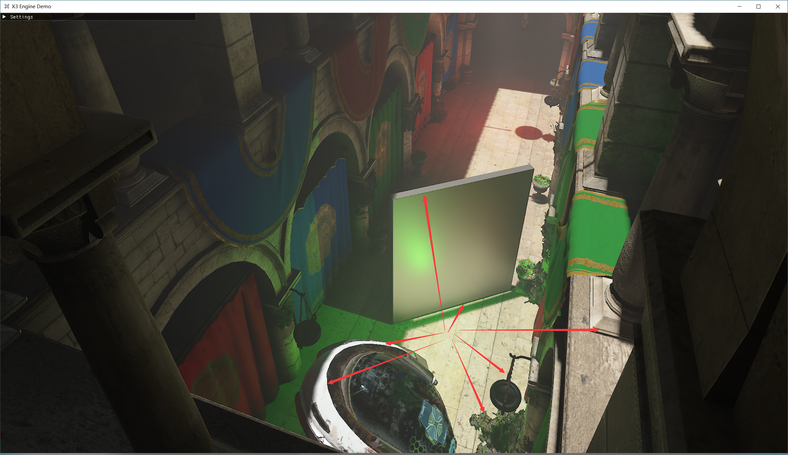
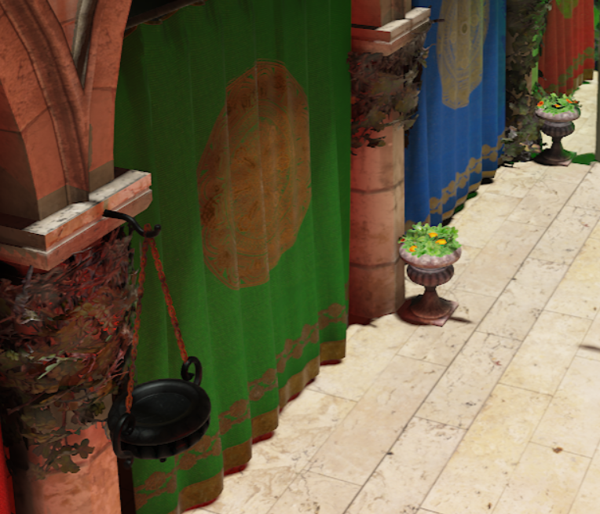
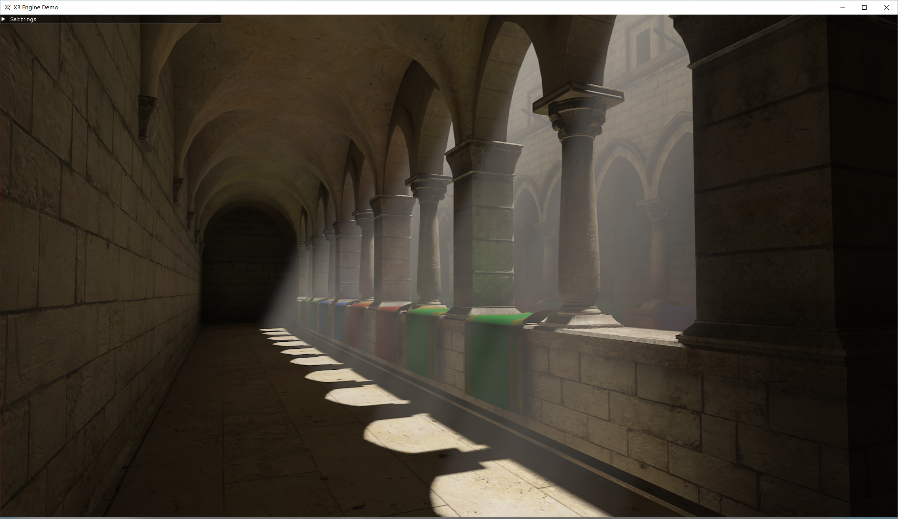

# X Renderer

## Introduction
This is a renderer based on Vulkan SDK. The rendering core has been well encapsulated, and based on this, many classic algorithms in computer graphics have been implemented.
## Requirements
- Vulkan SDK
- C++20 compatible compiler
- CMake
## Set up & Compiling the demo application
All dependencies have been stored in the "./libs" directory, which may result in a slightly longer cloning time when you clone the project.

The CMakeLists.txt file is written in a very simple manner, so you can simply run the Build.bat file to compile the project.
```
    git clone  
    cd X_Renderer
    mkdir build
    run Build.bat
```
There are three main projects that need to be compiled: XEngine (the core engine of the project, primarily focused on rendering functionality), ImGuiExtension (used for basic UI rendering), and XRendererDemo (a demo program for testing the engine).

### CMake build options
- **X_BUILD_SHARED** Force project to be build as a shared library
- **X_EXPORT_MAIN** Export the main file to be added as executable to parent project (only if main function cannot be found)
- **X_NO_APP** Disables the engines main function and app functionality. You have to code the main function and
initialize the engine yourself
- **X_IMGUI** Enables the [ImGui](https://github.com/ocornut/imgui) integration. Is enabled by default if the demo project is build.
- **X_ASSIMP** Enables the [Assimp](https://github.com/assimp/assimp) integration. Is enabled by default.

## Engine Features
- [x] **Vulkan Rendering System**
- [x] **Asset Manager**
- [x] **Shader Compilation (now only support glsl)**
- [x] **Input Manager (KeyBoard, Mouse, Stroll and etc.)**
- [x] **Simple ImGui UI & UI Control**
- [x] **Real-Time Ray Tracing Architecture**
- [x] **Profiler**


### TODO:
- [ ] **Animation**
- [ ] **Introducing new Layers & new Components to implement new features, such as Physics, Audio, ScriptSystem & etc.**
- [ ] **Optimize Compilation and Code**
<br>

## Rendering Features:
- [x] **Deffered Rendering Pipeline**
- [x] **PBR(Physical Based Rendering)**
- [x] **IBL(Image Based Lighting)**
- [x] **Skybox Rendering**
- [x] **Tile/Cluster Based LightCulling**
- [x] **Volumetric Cloud (atmosphere rendering)**
- [x] **RayMarching Volumetric**
- [x] **Froxel Volumetric**
- [x] **Basic Fog**
- [x] **CSM(Cascaded Shadow Map)**
- [x] **RTAO(Ray Tracing Ambient Occlusion)**
- [x] **Real Time DDGI(Dynamic Diffuse Global Illumination)**
- [x] **Ray Tracing Reflection(Dynamic Diffuse Global Illumination)**
- [x] **SSS Screen Space Shadow**
- [x] **TAA(Temperal Anti-Aliasing)**
- [x] **GBuffer DownSampling**
- [x] **Post-Processing such Sharpen Blur and etc.**
- [ ] 

### TODO:
- [ ] **Path Tracing (not fixed yet)**
- [ ] **Introducing new Layers & new Components to implement new features, such as Physics, Audio, ScriptSystem & etc.**
- [ ] **Optimize Compilation and Code**
<br>

## Screenshots
 <br/>
*A Renderer Demo ScreenShot* <br/>
### AA Anti-Aliasing

*without TAA*

*with TAA*

### AO Ambient Occlusion

*SSAO Debug*

*RTAO Debug*

*Without RTAO*

*with RTAO*

### SSS Screen Space Shadow
<br/>
*SSS Debug*

<br/>
*without SSS*

<br/>
*with SSS*

### GI Global Illumination

*DDGI Debug*

*without DDGI*

*with DDGI*

### Reflection 

*RT Reflection Debug*

*without RT Reflection*

*with RT Reflection*

### Volumetric Fog 

*Ray Marching Volume*

*Froxel Volume*

*froxel Supports PointLights*

### Cloud & atmosphere 

*Cloud & atmosphere*
atmosphere
