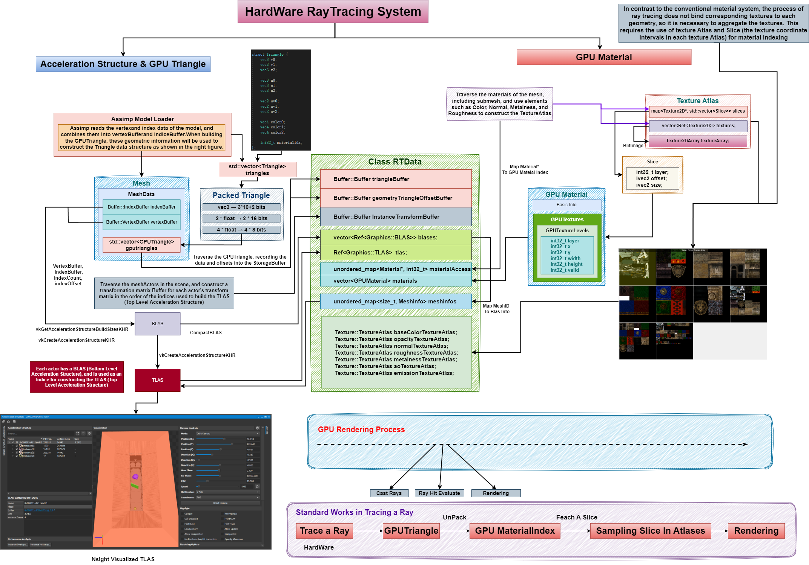

# X Renderer

## Introduction
This is a renderer based on Vulkan SDK. The rendering core has been well encapsulated, and based on this, many classic algorithms in computer graphics have been implemented.
## Requirements
- Vulkan SDK
- C++20 compatible compiler
- CMake
## Set up & Compiling the demo application
All dependencies have been stored in the "./libs" directory, which may result in a slightly longer cloning time when you clone the project.

The CMakeLists.txt file is written in a very simple manner, so you can simply run the Build.bat file to compile the project.
```
    git clone  
    cd X_Renderer
    mkdir build
    run Build.bat
```
There are three main projects that need to be compiled: XEngine (the core engine of the project, primarily focused on rendering functionality), ImGuiExtension (used for basic UI rendering), and XRendererDemo (a demo program for testing the engine).

### CMake build options
- **X_BUILD_SHARED** Force project to be build as a shared library
- **X_EXPORT_MAIN** Export the main file to be added as executable to parent project (only if main function cannot be found)
- **X_NO_APP** Disables the engines main function and app functionality. You have to code the main function and
initialize the engine yourself
- **X_IMGUI** Enables the [ImGui](https://github.com/ocornut/imgui) integration. Is enabled by default if the demo project is build.
- **X_ASSIMP** Enables the [Assimp](https://github.com/assimp/assimp) integration. Is enabled by default.

## Engine Features
- [x] **Vulkan Rendering System**
- [x] **Asset Manager**
- [x] **Shader Compilation (now only support glsl)**
- [x] **Input Manager (KeyBoard, Mouse, Stroll and etc.)**
- [x] **Simple ImGui UI & UI Control**
- [x] **Real-Time Ray Tracing Architecture**
- [x] **Profiler**


### TODO:
- [ ] **Animation**
- [ ] **Introducing new Layers & new Components to implement new features, such as Physics, Audio, ScriptSystem & etc.**
- [ ] **Optimize Compilation and Code**
<br>

## Rendering Features:
- [x] **Deffered Rendering Pipeline**
- [x] **PBR(Physical Based Rendering)**
- [x] **IBL(Image Based Lighting)**
- [x] **Skybox Rendering**
- [x] **Tile/Cluster Based LightCulling**
- [x] **Volumetric Cloud (atmosphere rendering)**
- [x] **RayMarching Volumetric**
- [x] **Froxel Volumetric**
- [x] **Basic Fog**
- [x] **CSM(Cascaded Shadow Map)**
- [x] **RTAO(Ray Tracing Ambient Occlusion)**
- [x] **Real Time DDGI(Dynamic Diffuse Global Illumination)**
- [x] **Ray Tracing Reflection(Dynamic Diffuse Global Illumination)**
- [x] **SSS Screen Space Shadow**
- [x] **TAA(Temperal Anti-Aliasing)**
- [x] **GBuffer DownSampling**
- [x] **Post-Processing such Sharpen Blur and etc.**
- [ ] 

### TODO:
- [ ] **Path Tracing (not fixed yet)**
- [ ] **Introducing new Layers & new Components to implement new features, such as Physics, Audio, ScriptSystem & etc.**
- [ ] **Optimize Compilation and Code**
<br>

## System Analysis
This chapter is dedicated to summarizing the existing system architecture that I personally find valuable. The goal is to create diagrams for better comprehension and learning.

### Material System
 <br/>
The system has designed a class called "Material," which includes shared_ptr for various textures and manual settings for material parameters. Typically, materials are associated with meshes, where a mesh can have multiple materials to describe its properties. Third-party models are loaded using assimp, loading pictures into u8 images, which are later transformed into textures required by the material. Additionally, manual settings for materials, such as debugging materials and materials for regular geometry, can be configured.

During each rendering loop, all materials are traversed, and a hash table <Material, Index> is generated. All material parameters (excluding textures but including flagBits indicating which textures the material has) are then packed into a uniform buffer and sent to the GPU. During actual rendering, a MaterialIdx gBuffer is rendered to record the material index for each mesh during deferred rendering (CPU side queries the hash table mentioned earlier for PushConstant).

### Hardware RayTracing System
 <br/>
The hardware ray tracing system mainly revolves around the RTData bit core. First of all, it should be noted that the ray tracing system cannot bind the corresponding texture resources and Vertexbuffer of the model during drawing, just like drawing each instance. Instead, it needs to consider merging the triangle information, texture information, material information, etc. required for GPU rendering, and transmitting them to GPU through a uniform buffer, On the GPU side, the compressed GPUTriangle is retrieved from the triangle index tracked through the hardware ray tracing interface. After parsing, the GPU material index can be obtained, and the GPU material will be identified through Slice to indicate the offset and size of the layer and UV of this material in TextureAtlas (as shown on the right side of the figure).

How to compress and build the GPUTriangle mentioned above is shown in the upper left of the figure. At the same time, this area also explains how to build the underlying acceleration structure and the top-level acceleration structure through indexBuffer and VertexBuffer. TLAS can also be directly visualized in Nsight. Specifically, call the hardware optical tracing interface in the shader to get the index of the traced triangle in TLAS, Then, combined with the buffer of the constructed set GPUTriangle information, relevant ray tracing information is obtained.

## Screenshots
 <br/>
*A Renderer Demo ScreenShot* <br/>
### AA Anti-Aliasing

*without TAA*

*with TAA*

### AO Ambient Occlusion

*SSAO Debug*

*RTAO Debug*

*Without RTAO*

*with RTAO*

### SSS Screen Space Shadow
<br/>
*SSS Debug*

<br/>
*without SSS*

<br/>
*with SSS*

### GI Global Illumination

*DDGI Debug*

*without DDGI*

*with DDGI*

### Reflection 

*RT Reflection Debug*

*without RT Reflection*

*with RT Reflection*

### Volumetric Fog 

*Ray Marching Volume*

*Froxel Volume*

*froxel Supports PointLights*

### Cloud & atmosphere 

*Cloud & atmosphere*
atmosphere
